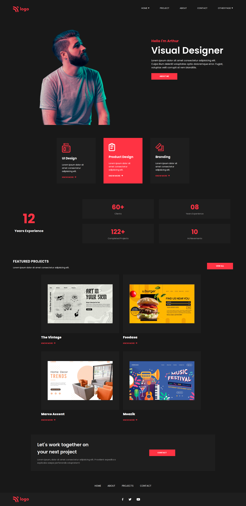

# Project 15

### `Nishok Maharaaj`

## Learnings    

This is the fifteenth project of HTML and CSS class. In this I have got used to all the CSS properties learnt and came to know how to use them effectively which helped in designing the cards, banners and images in this webpage.

## Efforts

This project took around 4 hours to build the webpage, most of the time is spent in designing the card elements and the banners in this webpage.

### Screenshot

